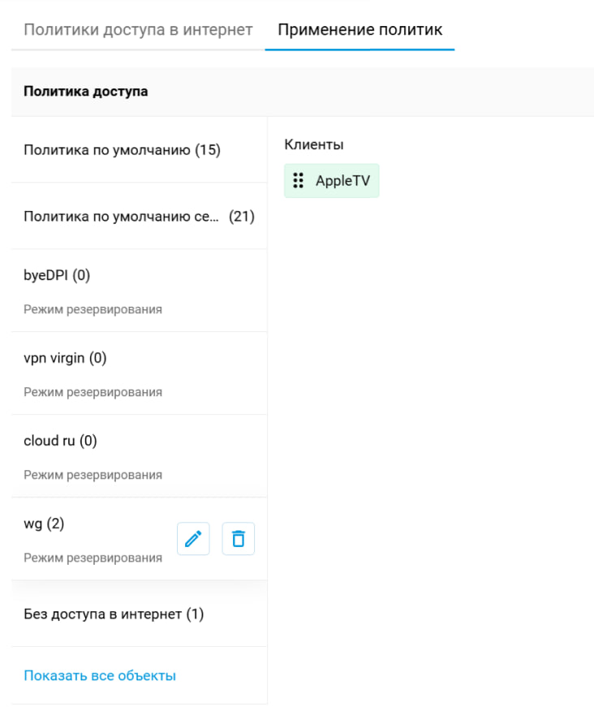
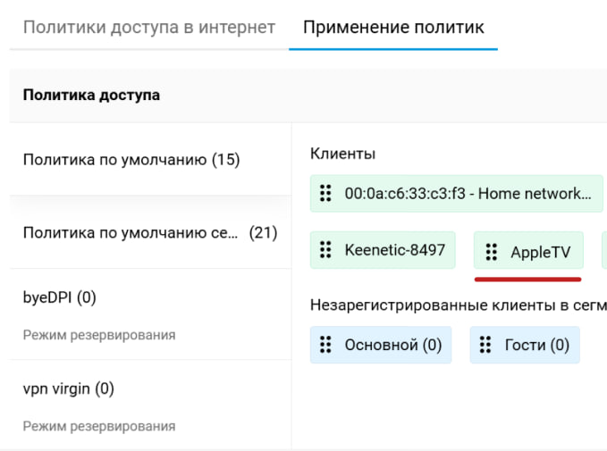

# Keenetic VPN Switch

Веб-приложение для управления доступом конкретного устройства через API роутера Keenetic.


## Возможности

- Получение текущего статуса устройства.
- Включение и выключение доступа через изменение политики. 
- Веб страница с кнопкой управления доступа устройтва.
- API для получения и изменения статуса устройства.
---

## Как работает приложение

Общая схема работы:

```text
Пользователь
    ↓
Веб-интерфейс
    ↓
Проверка текущего статуса устройства
    ↓
Установка статуса устройства
```

---

## Установка

### Клонирование репозитория

```bash
git clone <repository-url>
cd VPN-switch
npm install
```

---

## Настройка

Перед запуском необходимо заполнить файл `config.yaml`.

Пример:

```yaml
mac: "AA:BB:CC:DD:EE:FF" # MAC-адрес устройства
policy: "Policy3" # Политика для управления доступом устройства
URL: "http://192.168.1.1:8881/rci/" # Адрес API роутера Keenetic
serverPort: 3002 # Порт веб-сервера
```

### Принцип работы

При нажатии кнопки на веб-странице приложение изменяет политику устройства, изменяя его статус между `on` и `off`.

### Пример изменения статуса

**До изменения**



**Изменение статуса**

```text
Статус on
    ↓
Нажатие кнопки
    ↓
Изменение политики
    ↓
Статус off
```

**После изменения**



---

## Запуск

Для запуска приложения:

```bash
npm start
```

---

## API

### Получение текущего статуса

Возвращает текущий статус устройства.

#### Запрос

- **Метод:** `GET`
- **Путь:** `/api/status`

#### Успешный ответ (`200 OK`)

```json
{
  "status": "on"
}
```

или:

```json
{
  "status": "off"
}
```

---

### Изменение статуса

Изменяет политику устройства в зависимости от переданного статуса.

#### Запрос

- **Метод:** `POST`
- **Путь:** `/api/status`
- **Тело запроса (JSON):**

```json
{
  "status": "on"
}
```

или:

```json
{
  "status": "off"
}
```

#### Допустимые значения

| Поле | Тип | Обязательное | Значения |
|---|---|---|---|
| `status` | string | Да | `on`, `off` |

#### Возможные ошибки

| Код | Описание |
|---|---|
| `400` | Переданы некорректные данные |
| `502` | Ошибка подключения к роутеру |
| `500` | Внутренняя ошибка сервера |


---

## Используемые технологии

- [Node.js](https://nodejs.org/)
- [Express](https://expressjs.com/)
- [Axios](https://axios-http.com/)
- [Yup](https://github.com/jquense/yup)
- [YAML](https://eemeli.org/yaml/)

---

## Нужна помощь?

Любой вклад приветствуется 🙌! Самый простой способ поддержать проект — поставить ему `⭐️ Star` на GitHub или сообщить о проблеме, создав `🐞 Issue`.


